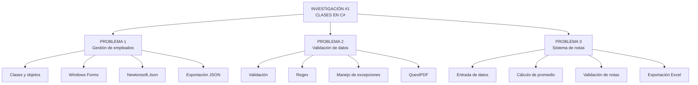
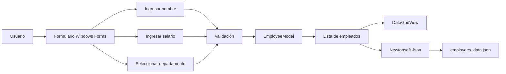
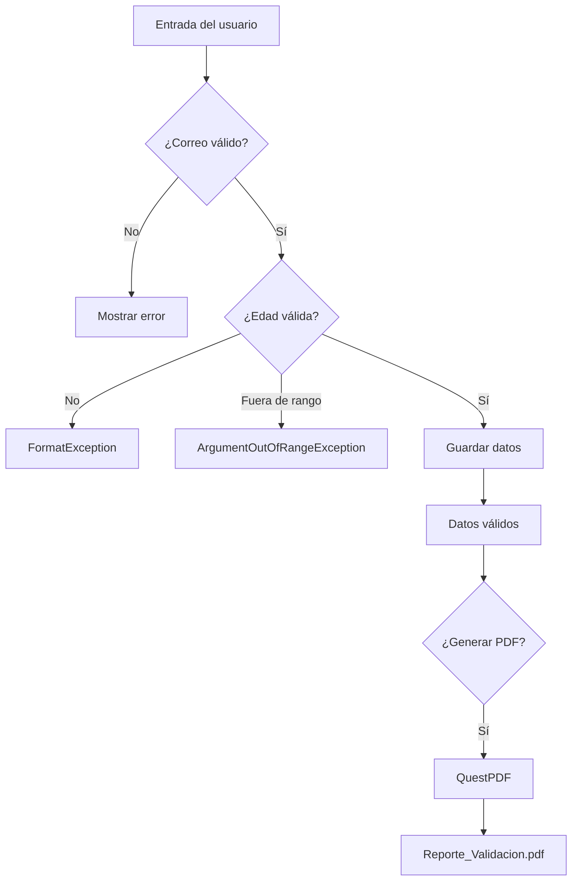
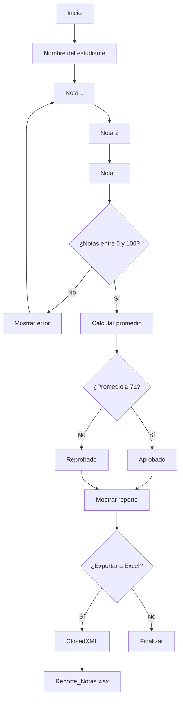
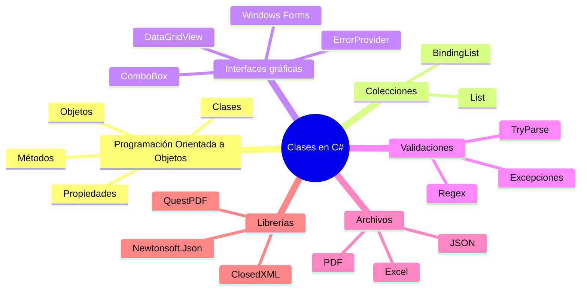
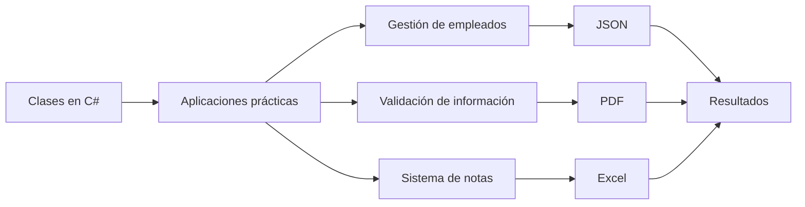

<div align="center">

# INVESTIGACIÓN #1 — CLASES EN C#

### Programación Orientada a Objetos · C# · Windows Forms · .NET


<br>

<p>
  <strong>Universidad Tecnológica de Panamá</strong><br>
  Facultad de Ingeniería de Sistemas Computacionales
</p>

<p>
  Investigación práctica sobre clases, objetos, validaciones,
  serialización y generación de archivos utilizando C#.
</p>

</div>

---

## Tecnologías utilizadas

<div align="center">


<br><br>


</div>

---

## Descripción

Este repositorio contiene la **Investigación #1 sobre Clases en C#**, desarrollada mediante diferentes aplicaciones que permiten aplicar conceptos fundamentales de programación y desarrollo de software.

Los ejercicios implementan diferentes escenarios prácticos utilizando:

* Clases y objetos.
* Propiedades.
* Métodos.
* Colecciones.
* Windows Forms.
* Validación de datos.
* Manejo de excepciones.
* Serialización JSON.
* Generación de documentos PDF.
* Generación de archivos Excel.
* Manejo de paquetes NuGet.
* Entrada y salida de información.

La investigación está dividida en **tres proyectos principales**, cada uno orientado a resolver un problema específico.

---

# Contenido del proyecto



---

# Problema 1 — Gestión de empleados y JSON

<div align="center">


</div>

## Descripción

El primer proyecto implementa una aplicación de escritorio desarrollada con **Windows Forms**, cuyo objetivo es registrar empleados mediante una interfaz gráfica.

Cada empleado se representa mediante una clase `EmployeeModel`, que contiene información como:

* ID.
* Nombre completo.
* Departamento.
* Salario.

Los empleados son almacenados en una colección y posteriormente pueden ser exportados a un archivo JSON.

## Clase principal

```text
EmployeeModel
├── Id
├── FullName
├── Department
└── Salary
```

## Funcionalidades

* Registro de empleados.
* Validación del nombre.
* Validación del salario.
* Selección del departamento.
* Visualización mediante `DataGridView`.
* Uso de `BindingList`.
* Serialización de objetos a JSON.
* Generación de `employees_data.json`.
* Manejo de excepciones.

## Flujo



## Tecnologías

* C#
* .NET Framework 4.7.2
* Windows Forms
* Newtonsoft.Json
* Visual Studio

---

# Problema 2 — Validación de datos y generación de PDF

<div align="center">


</div>

## Descripción

El segundo proyecto consiste en una aplicación Windows Forms enfocada en la **validación de información ingresada por el usuario**.

La aplicación permite validar:

* Correo electrónico.
* Edad.
* Rango permitido de edad.

Después de validar correctamente los datos, el usuario puede generar un reporte en formato PDF.

## Validaciones implementadas

### Correo electrónico

Se utiliza una expresión regular para comprobar que el correo tenga un formato válido.

```text
usuario@dominio.com
```

### Edad

La edad debe cumplir:

```text
18 ≤ edad ≤ 99
```

También se restringe el campo para permitir únicamente caracteres numéricos.

## Manejo de excepciones

El programa contempla diferentes tipos de errores:



## Funcionalidades

* Validación de correo mediante Regex.
* Validación de edad.
* Restricción de entrada numérica.
* `ErrorProvider` para mostrar errores.
* Manejo de excepciones.
* Registro de la hora de ejecución.
* Generación de documentos PDF.
* Reporte con los datos procesados.

## Archivo generado

```text
Reporte_Validacion.pdf
```

## Tecnologías

* C#
* .NET Framework 4.7.2
* Windows Forms
* QuestPDF
* Regex
* NuGet
* Visual Studio

---

# Problema 3 — Sistema de notas y exportación a Excel

<div align="center">


</div>

## Descripción

El tercer proyecto consiste en una aplicación de consola para gestionar las calificaciones de un estudiante.

El programa solicita:

* Nombre del estudiante.
* Nota 1.
* Nota 2.
* Nota 3.

Posteriormente calcula el promedio y determina si el estudiante está aprobado o reprobado.

## Reglas

Las notas deben encontrarse dentro del siguiente rango:

```text
0 ≤ nota ≤ 100
```

La condición de aprobación utilizada por el programa es:

```text
Promedio ≥ 71 → Aprobado
Promedio < 71 → Reprobado
```

## Flujo del programa



## Funcionalidades

* Entrada de datos desde consola.
* Validación de notas.
* Cálculo del promedio.
* Determinación del estado académico.
* Generación de reporte.
* Exportación a Excel.
* Formato automático de columnas.
* Archivo `.xlsx`.

## Archivo generado

```text
Reporte_Notas.xlsx
```

## Tecnologías

* C#
* .NET 10
* Aplicación de consola
* ClosedXML
* NuGet
* Visual Studio

---

# Estructura del repositorio

```text
INVESTIGACION-1-CLASES-EN-C-SHARP/
│
├── assets/
│   ├── banner-investigacion-clases-csharp.png
│   ├── problema-1-empleados-json.png
│   ├── problema-2-validacion-pdf.png
│   └── problema-3-notas-excel.png
│
├── CharlaProyecto(1)/
│   └── CharlaProyecto(1)/
│       ├── EmployeeModel.cs
│       ├── Form1.cs
│       ├── Form1.Designer.cs
│       └── Program.cs
│
├── CharlaProyecto(2)/
│   └── CharlaProyecto(2)/
│       ├── Form1.cs
│       ├── Form1.Designer.cs
│       └── Program.cs
│
├── CharlaEjemplo(3)/
│   └── CharlaEjemplo(3)/
│       ├── Program.cs
│       └── CharlaEjemplo(3).csproj
│
└── README.md
```

---

# Conceptos aplicados



---

# Herramientas y librerías

| Tecnología      | Uso                          |
| --------------- | ---------------------------- |
| C#              | Lenguaje principal           |
| .NET Framework  | Aplicaciones Windows Forms   |
| .NET 10         | Aplicación de consola        |
| Windows Forms   | Interfaces gráficas          |
| Newtonsoft.Json | Serialización JSON           |
| QuestPDF        | Generación de documentos PDF |
| ClosedXML       | Generación de archivos Excel |
| NuGet           | Gestión de paquetes          |
| Visual Studio   | Entorno de desarrollo        |
| Git             | Control de versiones         |
| GitHub          | Repositorio y colaboración   |

---

# Integrantes

<div align="center">

| Integrante           |
| -------------------- |
| **Victor Montes**    |
| **Michael Hunt**     |
| **Kankive Gonzalez** |

</div>

---

# Objetivo académico

El objetivo de esta investigación es reforzar los fundamentos de **C# y la Programación Orientada a Objetos** mediante la creación de aplicaciones prácticas.

Los diferentes ejercicios permiten trabajar con clases, propiedades, métodos, colecciones, interfaces gráficas, validación de información, manejo de errores y generación de archivos.

---

# Resultados



---

# Requisitos

Para ejecutar los proyectos se recomienda contar con:

* Windows.
* Visual Studio.
* .NET Framework 4.7.2.
* .NET 10 SDK.
* NuGet.
* Dependencias restauradas.

Las aplicaciones Windows Forms corresponden a proyectos basados en **.NET Framework 4.7.2**, mientras que el tercer ejercicio utiliza **.NET 10**.

---

# Ejecución

### 1. Clonar el repositorio

```bash
git clone https://github.com/VITIDEV06/INVESTIGACION-1-CLASES-EN-C-SHARP.git
```

### 2. Entrar al proyecto

```bash
cd INVESTIGACION-1-CLASES-EN-C-SHARP
```

### 3. Restaurar dependencias

Abrir el proyecto correspondiente desde Visual Studio y restaurar los paquetes NuGet.

### 4. Ejecutar

Seleccionar el proyecto que se desea ejecutar y presionar:

```text
F5
```

o ejecutar sin depuración:

```text
Ctrl + F5
```

---

# Archivos generados

Durante la ejecución de los proyectos se pueden generar diferentes archivos:

```text
employees_data.json
Reporte_Validacion.pdf
Reporte_Notas.xlsx
```

Estos archivos contienen los resultados producidos por cada aplicación.

---

<div align="center">

## Investigación #1 — Clases en C#

**Victor Montes · Michael Hunt · Kankive Gonzalez**

<br>

Desarrollado con C# y .NET

</div>
